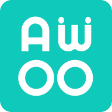
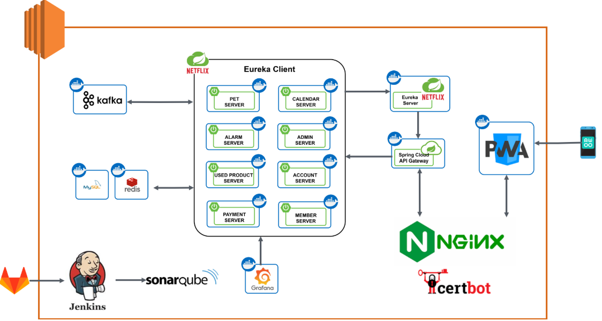

#   AwOO

## :paw_prints: 프로젝트 개요

> ### :sparkles: 프로젝트 소개
> ### :brain: 프로젝트 기획 배경
> ### :dart: 프로젝트 목표

## 개발 환경

### :iphone: 프론트엔드
  
   

    

  

### :computer: 백엔드
   
   

  

  
### :globe_with_meridians: 인프라
   

### :card_index_dividers: 매니지먼트 툴
  

## 아키텍처 

## ERD

