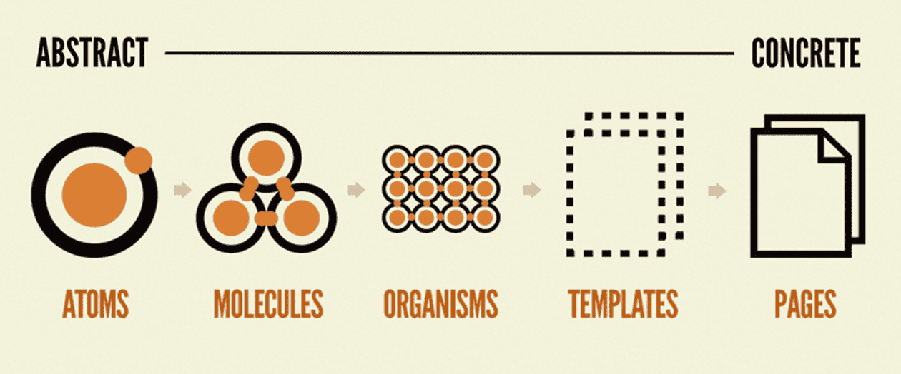

# Today I Learned
<details> <summary><strong>1주차</strong></summary>
<details> <summary><strong>0304</strong></summary>

## StoryBook

### _StoryBook이란?_

- 컴포넌트 단위의 UI 개발 (Component-Driven Development, CDD) 환경 지원 도구
- React, Vue, Angular 등 다양한 프레임워크 지원

### 주요 특징

1. 독립적인 컴포넌트 개발
   - Storybook을 사용하면 전체 애플리케이션을 실행하지 않고도 개별 UI 컴포넌트를 개발하고 확인할 수 있다.
2. 컴포넌트 카탈로그
   - 개발한 모든 UI 컴포넌트를 한곳에 관리할 수 있어 디자인 시스템을 구축하는 데 유용하다.
3. 자동 문서화
   - Storybook은 컴포넌트의 Prop(속성), 상태, 이벤트 등의 정보를 자동으로 문서화해준다.
4. 상호작용 테스트
   - Jest나 Testing Library같은 도구를 사용하여 UI의 동작을 테스트할 수 있다.

### 이럴 때 쓰면 좋다!

- 컴포넌트 단위의 개발을 할 때
- 디자인 시스템을 구축할 때
- 프론트엔드와 백엔드 개발을 병렬로 진행할 때
- 디자이너, QA 팀과 협업할 때
</details>

<details> <summary><strong>0305</strong></summary>

## Next.js와 React의 차이

### _Next.js와 React의 가장 큰 차이는?_

- Next.js는 서버 사이드 렌더링(SSR)과 정적 사이트 생성(SSG) 등의 기능을 기본적으로 제공한다는 점이다. React는 클라이언트 사이드 렌더링 (CSR)만 기본 지원하지만, Next.js는 CSR 뿐만 아니라 SSR, SSG, ISR(증분 정적 생성)도 가능해서 SEO나 성능 최적화에서 유리하다.

### 주요 차이점 정리

|         기능          |                React                 |                      Next.js                      |
| :-------------------: | :----------------------------------: | :-----------------------------------------------: |
|      렌더링 방식      |                 CSR                  |              CSR, SSR, SSG, ISR 지원              |
|        라우팅         |        `react-router-dom`필요        |         파일 기반 라우팅 (pages/디렉토리)         |
|          SEO          | 기본적으로 불리함(JS 실행 후 렌더링) |           SSR 및 SSG로 SEO 최적화 가능            |
|      API 라우트       |                 없음                 |        `/api/`경로에서 API 서버 제공 가능         |
|     이미지 최적화     |                 없음                 |        `next/image`로 최적화된 이미지 제공        |
| 번들링 및 성능 최적화 |            직접 설정 필요            | 자동 코드 분할, Tree Shaking, 빠른 로딩 속도 지원 |

### _이런 경우엔 Next.js가 좋다!_

- SEO가 중요한 서비스 (블로그, 쇼핑몰, 뉴스 사이트 등)
- 초기 로딩 속도를 빠르게 해야 하는 경우
- 정적 페이지를 미리 생성하여 성능을 높이고 싶은 경우
- 백엔드 없이 간단한 API 서버도 함께 운영하고 싶은 경우

### _이런 경우엔 React만 써도 좋다!_

- 단순한 SPA(싱글 페이지 애플리케이션)
- SSR이 필요 없고, 사용자 인터랙션이 많은 대시보드나 웹앱
- CSR로도 충분한 경우(SEO가 필요 없는 내부 시스템 등)

### _So What?!_

- Next.js는 React의 확장판이다.
- 기본적으로 React로 개발하는 것과 비슷하지만, 추가적인 기능(SSR, SSG, API 라우트 등)이 내장되어 있어 프로젝트에 따라 더 적합할 수도 있다.
- 요즘 채용공고에서 기술 스택으로 많이 보이던데 써보는 것도 좋을지도...!!!

</details>

<details> <summary><strong>0306</strong></summary>

## PWA란?

- PWA(Progressive Web App)는 웹 애플리케이션을 네이티브 앱처럼 사용할 수 있도록 만들어주는 기술.
- 기본적으로 웹에서 동작하지만, 네이티브 앱과 비슷한 사용자 경험을 제공한다.

### _PWA의 주요 특징_

1. 오프라인 지원
   - 서비스 워커 (Service Worker)를 이용해 캐싱을 관리하여 네트워크 연결이 없어도 앱을 사용할 수 있다.
2. 빠른 로딩 속도
   - 데이터를 캐싱해서 웹 페이지를 빠르게 로딩할 수 있다.
3. 푸시 알림 지원
   - 브라우저를 닫아도 푸시 알림을 받을 수 있다.
4. 홈 화면 추가 기능
   - 사용자가 앱을 설치하지 않아도 홈 화면에 아이콘을 추가하여 네이티브 앱처럼 실행할 수 있다.
5. 반응형 디자인
   - 다양한 기기(모바일, 태블릿, 데스크톱)에서 최적화된 UI를 제공한다
6. 앱 스토어 등록 없이 사용 가능
   - 네이티브 앱처럼 별도로 앱 마켓 (구글 플레이, 앱 스토어)에 등록하지 않아도 사용자가 웹에서 바로 접근 가능

### _PWA 적용을 위해 필요한 기술_

- 서비스 워커(Service Worker): 백그라운드에서 캐싱 및 푸시 알림을 담당하는 스크립트
- 웹 매니페스트(Web App Manifest): 앱의 아이콘, 색상, 시작 페이지 등을 정의하는 JSON 파일
- HTTPS: 보안성을 위해 반드시 HTTPS 환경에서 실행

### _언제 PWA를 사용할까?_

- 앱을 개발할 예산이 부족하지만, 모바일 환경에서도 원활한 UX를 제공하고 싶을 때
- 웹사이트 방문자를 앱 사용자로 유도하고 싶을 때
- 오프라인에서도 일부 기능을 제공하고 싶을 때

</details>

<details> <summary><strong>0307</strong></summary>

## Atomic Design

[Atomic Desigb - Brad Frost](https://atomicdesign.bradfrost.com/chapter-2/)

- 화학점 관점에서 영감을 얻은 디자인 시스템
- 모든 것은 **_atom(원자)_** 로 구성되어 있고 atom 들이 서로 결합하여 **_molecule(분자)_** 이 되고, molecule는 더 복잡한 **_organism(유기체)_** 로 결합하여 궁극적으로 모든 물질을 생성
- Atomic Design에서는 이 개념을 차용해서 컴포넌트를 atom, molecule, organism, template, page의 5가지 레벨 나눔
  

### _Atom_

- 더 이상 분해할 수 없는 기본 컴포넌트
- label, input, button과 같이 기본 HTML element 태그 혹은 글꼴, 애니메이션, 컬러 팔레트, 레이아웃과 같이 추상적인 요소도 포함 가능
- atom과 다른 atom을 결합한 molecule 혹은 organism 단위에서 여러 단위와 결합하여 유용하게 사용 가능

### _Molecule_

- 여러 개의 atom을 결합하여 자신의 고유한 특성을 가진다
- **한 가지 일을 하는 것** 이 중요한 특징!
- SRP(Single Responsibility Principle)원칙으로 인해 키워드 전송 기능이 필요한 곳에서 재사용 가능

### _Organism_

- 더 복잡하고 서비스에서 표현될 수 있는 명확한 영역과 특정 컨텍스트를 가진다.
- atom, molecule, organism으로 구성 가능
- ex) logo(atom), navigation(molecule), search form(molecule)을 포함 가능
- atom, molecule에 비해 좀 더 구체적으로 표현되고 컨텍스트를 가지기 때문에 상대적으로 재사용성이 낮아지는 특성

### _Template_

- Page를 만들 수 있도록 여러 개의 organism, molecule로 구성 가능
- 실제 콘텐츠가 없는 page 수준의 스켈레톤

### _Page_

- 유저가 볼 수 있는 실제 콘텐츠
- template의 인스턴스

</details>
</details>

<details> <summary><strong>2주차</strong></summary>
<details> <summary><strong>0310</strong></summary>

### _SSR/SSG의 필요성_

- SPA 등의 클라이언트 사이드 렌더링은 그대로 사용하면 초기 표시가 지연되는 문제가 존재

#### SSR

- 서버 사이드 렌더링 (Server Side Rendering)
- 서버 사이드 자바스크립트 실행환경에서 요청에 대한 페이지를 생성해서 HTML을 반환하는 것
- 장점
  - 렌더링을 서버 사이드에서 수행한 결과를 반환하므로, 사이트를 빠르게 표시할 수 있다.
  - 서버 사이드에서 콘텐츠를 생성하므로, SPA에서는 복잡했던 SEO를 향상할 수 있다.
- 단점
  - Node.js 등 서버 사이드 자바스크립트 실행 환경이 필요하다
  - 서버 사이드에서 렌더링하므로 서버 CPU의 부하가 증가한다
  - 서버와 클라이언트에서 자바스크립트의 로직이 분산될 가능성이 있다

#### SSG

- 정적 사이트 생성 (Static Site Generation)
- 사전에 정적 파일로서 생성, 배포하는 구조
- 서버로 접근할 때 HTML을 생성하므로, 트래픽이 많을 때는 서버의 부하에 관해 고려해야만 하는 SSR의 관점을 보완

</details>

<details> <summary><strong>0311</strong></summary>

## TypeScript 1

- 자바스크립트에 정적 타입 기능 등을 탑재한 프로그래밍 언어로, 마이크로소프트가 중심이 되어 개발 추진
- 예시 자바스크립트 코드

```
function sayHello (firstName) {
   console.log('hello'+firstName)
}
let firstName = 'Hana'
sayHello(firstName)
```

- 위의 자바스크립트 코드를 타입스크립트로 변환한 코드

```
// firstName 뒤에 string 타입을 붙여, 문자열 이외의 값을 전달하지 못하게 할 수 있다.
function sayHello (firstName: string) {
   console.log('Hello'+firstName)
}
let firstName: string = 'Hana'
sayHello(firstName)
```

- 타입스크립트는 자바스크립트에 주로 다음 기능을 추가한 것
  - 타입 정의
  - 인터페이스와 클래스
  - null / undefined-safe
  - 범용적인 클래스나 메서드 타입을 실혀하는 제너릭(Generic)
  - 그 외, ECMA에서 정의되어 있는 자바스크립트의 최신 사양
- 단점
  - 프로젝트 규모에 따라 컴파일에 시간이 걸린다
  - 타입스크립트 경험자가 없을 경우, 도입을 위한 많은 학습 비용이 발생할 수도 있다.
  </details>

<details> <summary><strong>0312</strong></summary>

## useMemo와 useCallback의 차이

### _useMemo_

- 특정 값의 계산 결과를 메모이제이션하여, 디펜던시가 변경되지 않는 한 동일한 값을 반환
- 복잡한 계산을 반복적으로 수행하지 않도록 하여 성능을 최적화하는 데 유용

```
const memoizedValue = useMemo(() => {
   return computeExpensiveValue(a, b);
}. [a, b])
```

- 위의 코드에서 a와 b가 변경되지 않는 한 computeExpensiveValue 함수는 다시 호출되지 않는다.
  - 왜냐면 useMemo는 디펜던시 배열을 기반으로 메모이제이션된 값을 반환하기 때문
- useMemo는 특히 렌더링 비용이 높은 컴포넌트에서 유용
  - 복잡한 계산을 수행하거나, 대규모 데이터를 처리하는 경우에 사용하면 좋다
- **그러나** 모든 경우에 useMemo를 사용하는 것은 권장되지 않는다!
  - 왜냐면 메모이제이션 자체에도 비용이 발생하기 때문 -> 성능 최적화가 필요한 경우에만 사용하는 것이 좋다

### _useCallback_

- 특정 함수를 메모이제이션하여, 디펜던시가 변경되지 않는 한 동일한 함수를 반환. 자식 컴포넌트에 함수를 props로 전달할 때 유용

```
const memoizedCallback = useCallback(() => {
   doSomething(a, b);
}, [a, b])
```

- a와 b가 변경되지 않는 한 doSomething 함수는 새로 생성되지 않는다.
  - 왜냐하면 useCallback은 디펜던시 배열을 기반으로 메모이제이션 된 함수를 반환하기 때문
- useCallback은 특히 자식 컴포넌트가 React.memo로 최적화되어 있는 경우에 유용
  왜냐하면 함수가 변경되지 않으면, 자식 컴포넌트가 불필요하게 렌더링되지 않기 때문
- 하지만 모든 경우에 useCallback을 사용하는 것은 권장되지 않는다.
  - 왜냐하면 메모이제이션 자체에도 비용이 발생하기 때문. 따라서, 성능 최적화가 필요한 경우에만 사용하는 것이 좋다

### _useMemo와 useCallback의 차이점_

- useMemo와 useCallback은 비슷한 목적을 가지고 있지만, 사용하는 대상이 다르다.
- useMemo는 값을 메모이제이션하고, useCallback은 함수를 메모이제이션한다.

```
// useMemo
const memoizedValue = useMemo(() => computeExpensiveValue(a, b), [a, b]);

// useCallback
const memoizedCallback = useCallback(() => doSomething(a, b), [a, b]);
```

- useMemo는 계산된 값을 반환하고, useCallback은 메모이제이션된 함수를 반환한다.
  - useMemo는 값의 메모이제이션에 초점을 맞추고, useCallback은 함수의 메모이제이션에 초점을 맞추기 때문

</details>

<details> <summary><strong>0313</strong></summary>

## TypeScript 기본 문법

### _1. 기본 타입 선언_

```
# 문자열
let hello: string = "helloWorld!";

# 숫자
let tripleSeven: number = 777;

# 배열
let arr1: number[] = [10, 20, 30];
let arr2: Array<number> = [10, 20, 30];
let arr3: Array<string> = ["hello", "world"];
let arr4: [string, number] = ["eunsu". 26]

# 객체
let eunsu: object = {
   name: "eunsu",
   age: 26
};
let person: { name: string, age: number } = {name: "eunsu", age: 26}
```

### _2. 함수 선언_

```
# 2-1. 함수 타입 선언
function add(x: number, y: number): number {
   return x + y;
};

# 2-2. 선택적 매개변수 (optional parameter)
function buildName(firstName: string, lastName?: string) {
   if (lastName)
      return firstName + " " + lastName
   else
      return firstName
};

let result1 = buildName("Bob");
let result2 = buildName("Bob", "Adams", "Sr."); // 에러
let result3 = buildName("Bob", "Adams");

```

### _3. 인터페이스(Interface)_

- TypeScript 의 핵심 원칙 중 하나는 타입 검사가 값의 **형태**에 초점을 맞추고 있다는 것이다.
- 이를 "덕 타이핑(duck typing)" 혹은 "구조적 서브타이핑(structural subtyping)"이라고도 한다.
- TypeScript에서 인터페이스는 이런 타입들의 이름을 짓는 역할을 하고 코드 안의 계약을 정의하는 것뿐만 아니라 프로젝트 외부에서 사용하는 코드의 계약을 정의하는 강력한 방법
- `interface`는 자주 사용하는 타입들을 object 형태의 묶음으로 정의해 **새로운 타입**을 만드는 기능이다.

```
# 3-1. interface 선언
interface User {
   age: number;
   name`
}

# 3-2. 변수 활용
const eunsu: User = {name:"eunsu", age:26}

# 3-3. 함수 인자로의 활용
function getUser(user:User) {
   console.log(user)
}
getUser({name:"eunsu", age: 26})

# 3-4. 함수 구조 활용
interface Add {
   (x: number, y:number): number;
}
let addFunc: Add = (a, b) => a + b;
console.log(addFunc(14, 7))

# 3-5. 배열 활용
interface StringArr {
   [index: number]: string;
}
let arr: StringArr = ["a","b","c"]

# 3-6. 객체 활용
interface Obj {
   [key: string]: string;
}
const obj: Obj {
   person1: "eunsu",
   person2: "deokjin"
}

# 3-7. Interface 확장
interface Person {
   name: string,
   age: number;
}

interface Developer extends Person {
   position: string
}

const eunsu: Developer = {
   name: "eunsu",
   age: 26,
   position: "FE"
}

```

</details>


<details> <summary><strong>0314</strong></summary>

## TypeScript 기본 문법 2

### _4.타입(Type)_

```
# 4-1. 타입 별칭 선언

type StrOrNum = string | number;

const str1: StrOrNum = "hello world";
const str2: strOrNum = 777;

# 4-2. type VS interface
- 타입 별칭과 인터페이스의 가장 큰 차이점은 타입의 확장 가능 / 불가능 여부
- 인터페이스는 확장이 가능한데 반해 타입 별칭은 확장이 불가능하다. 따라서 가능한한 type보다는 interface로 선언해서 사용하는 것을 추천한다.
```

### _5. 연산자(Operator)_

```
# 5-1. 유니언 타입 (Union Type)
- 한 개 이상의 type을 선언할 때 사용할 수 있다.
- | 키워드를 사용한다.

function strOrnum (value: string | number) {
   if (typeof value === 'string') {
      value.toString();
   } else if (typeof value === 'number') {
      value.toLocalString();
   } else {
      throw new TypeError('문자열 또는 숫자를 넣어주세요!')
   }
}

strOrNum('hello world');
strOrNum(777);

# 5-2.교차 타입(Intersection Type)
- 합집합과 같은 개념
- 함수 호출의 경우, 함수 인자에 명시한 Type을 모두 제공해야 한다.
- & 키워드 사용

interface Person {
   name: string;
   age: number;
}
interface Developer {
   name: string;
   skill: string;
}

type Capt = person & Developer;

let devPerson: Capt = {
   name: "KimDeokJin",
   age: 28,
   skill: "FullStack"
}


```

</details>
</details>

<details> <summary><strong>3주차</strong></summary>

<details> <summary><strong>0317</strong></summary>

## use client를 사용하는 컴포넌트 vs 사용하지 않는 컴포넌트 차이
- Next.js에서 use client 지시어를 사용하면 클라이언트 컴포넌트(Client Component)로 동작하고, 사용하지 않음

### _서버 컴포넌트(기본값)_
- "use client"를 선언하지 않으면 기본적으로 **서버 컴포넌트(Server Component)**로 동작
- 서버에서 렌더링된 후 HTML만 클라이언트로 전달
- 브라우저에서 실행되는 JavaScript가 거의 없음
- useEffect, useState, useContext 와 같은 훅을 사용할 수 없음 (리액트 상태 관리 불가능)
- API 요청이나 데이터베이스 접근을 직접 수행 가능 (fetch나 DB 쿼리 가능)

### _클라이언트 컴포넌트(use client) 사용_
- "use client"를 선언하면 클라이언트 컴포넌트(Client Component)로 동작함
- 서버에서 HTML을 생성한 후, 클라이언트에서 리액트 상태 관리 및 인터랙션 가능
- useState, useEffect, useContext 같은 훅 사용 가능
- API 요청을 클라이언트에서 수행해야 함 (서버에서 직접 데이터베이스 접근 불가)

|                        | 서버 컴포넌트 (기본값)           | 클라이언트 컴포넌트 (`use client`)    |
|------------------------|----------------------------------|----------------------------------------|
| **렌더링 위치**        | 서버에서 렌더링 후 HTML만 전송    | 서버에서 HTML 생성 후 클라이언트에서 실행 |
| **상태 관리**          | `useState`, `useEffect` 사용 불가 | `useState`, `useEffect` 사용 가능       |
| **DB 접근**            | 가능 (`fetch`로 DB 접근 가능)     | 불가능 (API 요청으로 데이터 받아야 함)  |
| **인터랙션**           | 불가능 (정적 UI만 제공)           | 가능 (버튼 클릭, 입력 등 상호작용 지원) |
| **번들 크기**          | 작음 (JS 실행 없음)               | 큼 (JS 번들 포함됨)                     |
| **사용 예시**          | 초기 데이터 로드, SEO 최적화 페이지| 버튼, 폼, 드롭다운 등 사용자 상호작용 요소 |

</details>
<details> <summary><strong>0318</strong></summary>

## 회원가입 유효성 검사
### _정규식_
| 입력 허용 방식 | `replace()` 정규식 |
| --- | --- |
| **숫자 제외 (영문+한글만 허용)** | `/[^a-zA-Zㄱ-ㅎ가-힣\s]/g, ""` |
| **숫자+특수문자 제외 (오직 영문+한글만)** | `/[^a-zA-Zㄱ-ㅎ가-힣]/g, ""` |
| **한글만 허용** | `/[^ㄱ-ㅎ가-힣\s]/g, ""` |
| **영문만 허용** | `/[^a-zA-Z\s]/g, ""` |
| **숫자만 허용** | `/\D/g, ""` |

### _유효성 검사_
```
// 이름 5자리 제한
  const handleNameChange = (e: React.ChangeEvent<HTMLInputElement>) => {
    let value = e.target.value.replace(/[^ㄱ-ㅎ가-힣\s]/g, ""); // 한글만 입력 가능
    if (value.length > 5) {
      value = value.slice(0, 5);
      setNameErr("이름은 최대 5자리까지 입력 가능합니다.");
    } else if (value.length <= 4) {
      setNameErr("");
    } // 최대 5자리 제한

    setName(value);
  };

  // 생년월일 입력 시 자동으로 YYYY-MM-DD 형식으로 변환
  const handleBirthdateChange = (e: React.ChangeEvent<HTMLInputElement>) => {
    let value = e.target.value.replace(/\D/g, ""); // 숫자만 입력 가능
    if (value.length > 8) value = value.slice(0, 8); // 최대 8자리 제한

    // YYYY-MM-DD 형식
    if (value.length >= 4) value = value.slice(0, 4) + "-" + value.slice(4);
    if (value.length >= 7) value = value.slice(0, 7) + "-" + value.slice(7);

    setBirthdate(value);
  };

  // 전화번호 입력 시 자동으로 000-0000-0000 형식으로 변환
  const handlePhoneChange = (e: React.ChangeEvent<HTMLInputElement>) => {
    let value = e.target.value.replace(/\D/g, ""); //숫자만 입력 가능
    if (value.length > 11) value = value.slice(0, 11); // 최대 11자리

    if (value.length >= 3) value = value.slice(0, 3) + "-" + value.slice(3);
    if (value.length >= 8) value = value.slice(0, 8) + "-" + value.slice(8);

    setPhonenum(value);
  };

  // 이메일 유효성 검사 함수
  const validateEmail = (value: string) => {
    const emailRegex = /^[^\s@]+@[^\s@]+\.[^\s@]+$/;
    return emailRegex.test(value);
  };

  // 이메일 변경 시
  const handleEmailChange = (e: React.ChangeEvent<HTMLInputElement>) => {
    let value = e.target.value;
    setEmail(value);
    const isValid = validateEmail(value);
    setIsValidEmail(isValid); // 입력할 때마다 검사
    if (!isValid) {
      setEmailMessage(""); // 유요하지 않은 이메일일 경우 중복 검사 메시지 초기화
    }
  };

  // 이메일 중복 체크 - 백엔드 연결 필요
  const handleEmailCheck = () => {
    if (!isValidEmail || email.length === 0) {
      setEmailMessage("올바른 이메일을 입력하세요.");
      return;
    }

    // 백엔드 api 호출 + 결과값을 isDuplicate에 담기
    if (isDuplicate) {
      setEmailMessage("이미 사용 중인 이메일입니다.");
    } else {
      setEmailMessage("사용 가능한 이메일입니다.");
    }
  };

  // 비밀번호 유효성 검사 함수
  const validatePassword = (password: string) => {
    const passwordRegx = /^(?=.*[A-Za-z])(?=.*\d)(?=.*[!@#$%^&*])[A-Za-z\d!@#$%^&*]{8,}$/;
    return passwordRegx.test(password);
  };

  // 비밀번호 입력 시 유효성 검사
  const handlePasswordChange = (e: React.ChangeEvent<HTMLInputElement>) => {
    let value = e.target.value;
    setPassword1(value);

    if (!validatePassword(value)) {
      setIsValidPassword(false);
      setPasswordMessage("최소 8자 이상, 영문, 숫자, 특수문자를 포함해야 합니다.");
    } else {
      setIsValidPassword(true);
      setPasswordMessage("사용 가능한 비밀번호입니다.");
    }

    if (value.length === 0) {
      setPassword1("");
      setPasswordMessage("");
    }

    setIsMatch(value === password2);
  };

  // 비밀번호 확인 입력 변경 시 일치 여부 확인
  const handleConfirmPasswordChange = (e: React.ChangeEvent<HTMLInputElement>) => {
    let value = e.target.value;
    setPassword2(value);
    setIsMatch(password1 === value);
  };
  ```

</details>
<details> <summary><strong>0319</strong></summary>

## 스택(Stack)과 큐(Queue)
| 자료 구조 | 삭제되는 요소 |
| --- | --- |
| 스택(Stack) | 가장 최근에 들어온 데이터 |
| 큐(Queue) | 가장 먼저 들어온 데이터 |
| 우선순위 큐(Priority Queue) | 가장 우선순위가 높은 데이터 |

### _큐 (Queue)_
- 컴퓨터의 기본적인 자료 구조의 한 가지로, 먼저 집어넣은 데이터가 먼저 나오는 FIFO 구조로 저장하는 형식
- 우선순위 큐는 우선순위의 개념을 큐에 도입한 자료구조로, 데이터들이 우선순위를 가지고 있고 우선순위가 높은 데이터가 먼저 나가는 자료구조
   - 우선순위 큐는 배열, 연결리스트, 힙으로 구현 가능. 이중에서 **힙(heap)으로 구현하는 것이 가장 효율적**
   - 반면, 힙트리는 완전이진트리 구조이므로 힙트리의 높이는 log2(n+1)이며, 힙의 시간복잡도는 O(log2n)이다.

### _힙 (heap)_
- 힙(heap)은 최댓값 및 최솟갑을 찾아내는 연산을 빠르게 하기 위해 고안된 완전이진트리를 기본으로 한 자료구조
   - A가 B의 부모노드이면, A의 key값과 B의 key값 사이에는 대소관계가 성립한다.(반정렬 상태)
   - 키 값의 대소 관계는 부모/자식 간에만 성립하고, 형제노드 사이에는 대소 관계가 정해지지 않는다.
   - 이진탐색트리(BST)와 달리 중복된 값이 허용된다.

- 힙에는 '최대 힙'과 '최소 힙'이 있다.
   - 최대 힙 : 부모 노드의 키 값이 자식 노드보다 크거나 같은 완전이진트리이다.
❝ key(부모노드) ≥ key(자식노드) ❞
   - 최소 힙: 부모 노드의 키 값이 자식 노드보다 작거나 같은 완전이진트리이다.
   ❝ key(부모노드) ≥ key(자식노드) ❞

- 힙은 가장 높은 (혹은 가장 낮은) 우선 순위를 가지는 노드가 항상 루트노드에 오게 되는 특징이 있으며, 이를 응용하면 우선순위 큐와 같은 추상적 자료형을 구현할 수 있다.


</details>
<details> <summary><strong>0320</strong></summary>

## react-query (tanstack-query)
### _react-query_
- fetching, caching, 서버 데이터와의 동기화를 지원해주는 라이브러리
- React 환경에서의 비동기 Query(질의) 과정을 도와주는 라이브러리
- React Query는 React Application에서 서버 상태를 불러오고, 캐싱하며, 지속적으로 동기화하고 업데이트하는 작업을 도와주는 라이브러리
- 복잡하고 장황한 코드가 필요한 다른 데이터 불러오기 바익과 달리 React Component 내부에서 간단하고 직관적으로 API를 사용할 수 있다.
- React Quert에서 제공하는 캐싱, Window Focus Refetching 등 다양한 기능을 활용하여 API 요청과 관련된 번잡한 작업 없이 "핵심 로직"에 집중 가능

### _캐싱 (Caching)_
- 캐싱이란 특정 데이터의 복사본을 저장하여 이후 동일한 데이터의 재접근 속도를 높이는 것
- React-Query는 반복적인 비동기 데이터 호출을 방지하고, 이는 불필요한 API 콜을 줄여 서버에 대한 부하를 줄이는 좋은 결과
- React-Query는 최신 데이터를 fresh한 데이터, 기존의 데이터를 stale 한 데이터라고 한다
- 언제 데이터를 갱신하는가?
   - 화면을 보고 있을 때
   - 페이지의 전환이 일어났을 때
   - 페이지 전환 없이 이벤트가 발생해 데이터를 요청할 때
   ```
   refetchOnWindowFocus, //default: true
   refetchOnMount, //default: true
   refetchOnReconnect, //default: true
   staleTime, // default: 0
   cacheTime, // default: 5분 (60 *5 * 1000)
   ```
   - 리액트 쿼리가 Refetching 하는 시점
      - 1. 브라우저에 포커스가 들어온 경우 (refetchOnWindowFocus)
      - 2. 새로운 컴포넌트 마운트가 발생한 경우 (refetchOnMount)
      - 3. 네트워크 재연결이 발생한 경우 (refetchOnReconnect)

</details>
<details> <summary><strong>0321</strong></summary>

## React-Query - 2
### _staleTime & cacheTime_
- staleTime
   - staleTime은 데이터가 fresh -> stale 상태로 변경되는 데 걸리는 시간
   - fresh 상태일 때는 Refetch 트리거가 발생해도 Refetch가 일어나지 않는다.
   - 기본값이 0이므로 따로 설정해주지 않는다면 Refetch 트리거가 발생했을 때 무조건 Refetch가 발생한다.

- cacheTime
   - cacheTime은 데이터가 inactive한 상태일 때 캐싱된 상태로 남아있는 시간
   - 특정 컴포넌트가 unmount(페이지 전환 등으로 화면에서 사라질 때)되면 사용된 데이터는 inactive 상태로 바뀌고, 이때 데이터느 cacheTime 만큼 유지된다.
   - cacheTime 이후 데이터는 가비지 콜럭터로 수집되어 메모리에서 해제된다.
   - 만일 cacheTime이 지나지 않았는데 해당 데이터를 사용하는 컴포넌트가 다시 mount 되면, 새로운 데이터를 fetch 해오는 동안 캐싱된 데이터를 보여준다.
   - 즉, 캐싱된 데이터를 계속 보여주는 게 아닌, fetch하는 동안 임시로 보여준다는 것!

### Client 데이터와 Server 데이터 간의 분리
- Client data: 페이지 관련 데이터, 모달 관련 데이터 등등,,,
- Server data: 사용자 정보, 비즈니스 로직 관련 정보 등등,,,
- __**비동기 API 호출을 통해 불러오는 데이터**__들을 Server 데이터라고 할 수 있다.


</details>
</details>

<details> <summary><strong>4주차</strong></summary>

<details> <summary><strong>0324</strong></summary>

## SWR
- 데이터를 가져오기 위한 React Hooks
- HTTP 캐시 무효 전략인 `stale-while-revalidate`에서 유래
- SWR은 먼저 캐시(stale)로 부터 데이터를 반환 후, fetch 요청(revalidate)를 하고, 최종적으로 최신화된 데이터를 가져오는 전략

### _React Query와 SWR의 차이_
- ### 1. 기본 사용 방식
- **Provider 사용**
   - SWR: 별도의 Provider 없이 컴포넌트에서 바로 사용 가능. 설정이 간단해 초기에 프로젝트 구성시 빠르게 시작할 수 있다.
   - React-Query: 반드시 `Provider`로 컴포넌트를 감싸야 한다. 애플리케이션 전체에 걸친 데이터 관리를 일관되게 해주며, 쿼리 상태를 더 잘 통합할 수 있게 돕는다.
- ### 2. 데이터 관리와 처리
- **데이터 관리와 처리**
   - 데이터 전송 및 뮤테이션
      - SWR: `useSWR()`는 기본적으로 데이터를 읽어오는(read) 사용되며, 데이터를 클라이언트 측에서 직접 변경할 때는 mutate() 함수를 사용.
      - `mutate()`는 캐시된 데이터를 업데이트하고, 서버 요청 없이 클라이언트에서 즉시 데이터를 변경하는 데 사용
      - ! 사용자가 특정 데이터를 업데이트하면 이를 즉시 화면에 반영하고, 나중에 서버와 동기화하는 방식!
      - 이는 서버에 추가 요청을 보내기 전 UI를 빠르게 업데이트하는 데 유리. SWR 의 이 방식은 클라이언트 측에서 데이터가 자주 변경되거나, 서버 요청과 관계없이 빠른 UI 업데이트가 필요할 때 유리.
      - React Query: `useMutation()`을 사용하여 서버와 직접 상호작용하여 데이터를 전송하고 변경
      - 서버 상태를 동기화하고 관리하는 데 중점을 두기 때문에, 서버의 데이터를 변경하는 작업이 더 명확하게 처리
      - 사용자가 특정 데이터를 업데이트하면, 서버로 직접 요청을 보내어 데이터를 변경하고, 성공 시 해당 쿼리 데이터를 다시 가져오도록 하여 클라이언트와 서버 간의 상태가 일관되게 유지되도록 한다.
      - React Query는 서버의 상태를 일관되게 유지하고 데이터가 실제 서버와 동기화되도록 관리하는 데 최적화되어있다. 서버와의 통신이 중요한 대규모 애플리케이션에서 주로 사용

- ### 3.성능 및 최적화
- **렌더링 최적화**
   - SWR: 쿼리마다 개별적으로 컴포넌트를 업데이트하기 때문에 쿼리 개수가 많으면 렌더링 성능이 떨어질 수 있다.
   - React Query: 여러 컴포넌트가 동일한 쿼리를 사용할 경우, 한 번에 묶어서 업데이하여 성능이 더 뛰어나다. 이를 통해 리렌더링을 줄이고 성능 최적화를 달성할 수 있다.

- **캐싱 및 Garbage Colletion**
   - SWR: 자동으로 데이터를 캐싱하여 네트워크 요청을 줄일 수 있지만, 오래된 데이터(stale data)를 관리하는 방법이 부족. 데이터가 자주 업데이트 되지 않는 환경에서 적합하다.
   - React Query: 캐싱에 대한 세밀한 제어 가능. 사용되지 않는 쿼리를 자동으로 Garbage Collection 할 수 있다. 데이터가 빈번하게 업데이트되는 환경에서 React Query가 더 유리

</details>
<details> <summary><strong>0325</strong></summary>


</details>
<details> <summary><strong>0326</strong></summary>


</details>
<details> <summary><strong>0327</strong></summary>


</details>
<details> <summary><strong>0328</strong></summary>


</details>
</details>

<details> <summary><strong>5주차</strong></summary>

<details> <summary><strong>0331</strong></summary>


</details>
<details> <summary><strong>0401</strong></summary>


</details>
<details> <summary><strong>0402</strong></summary>


</details>
<details> <summary><strong>0403</strong></summary>


</details>
<details> <summary><strong>0404</strong></summary>


</details>
</details>


<details> <summary><strong>6주차</strong></summary>

<details> <summary><strong>0407</strong></summary>


</details>
<details> <summary><strong>0408</strong></summary>


</details>
<details> <summary><strong>0409</strong></summary>


</details>
<details> <summary><strong>0410</strong></summary>


</details>
<details> <summary><strong>0411</strong></summary>


</details>
</details>
